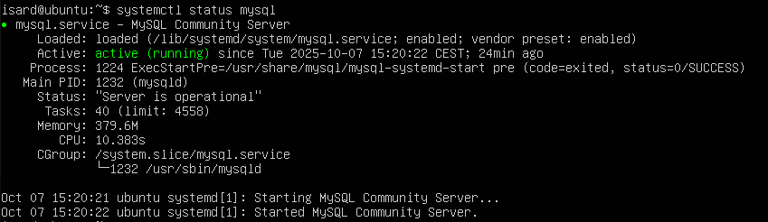
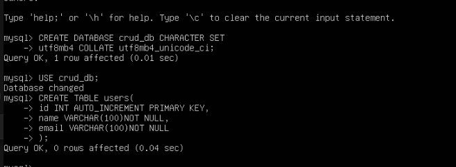
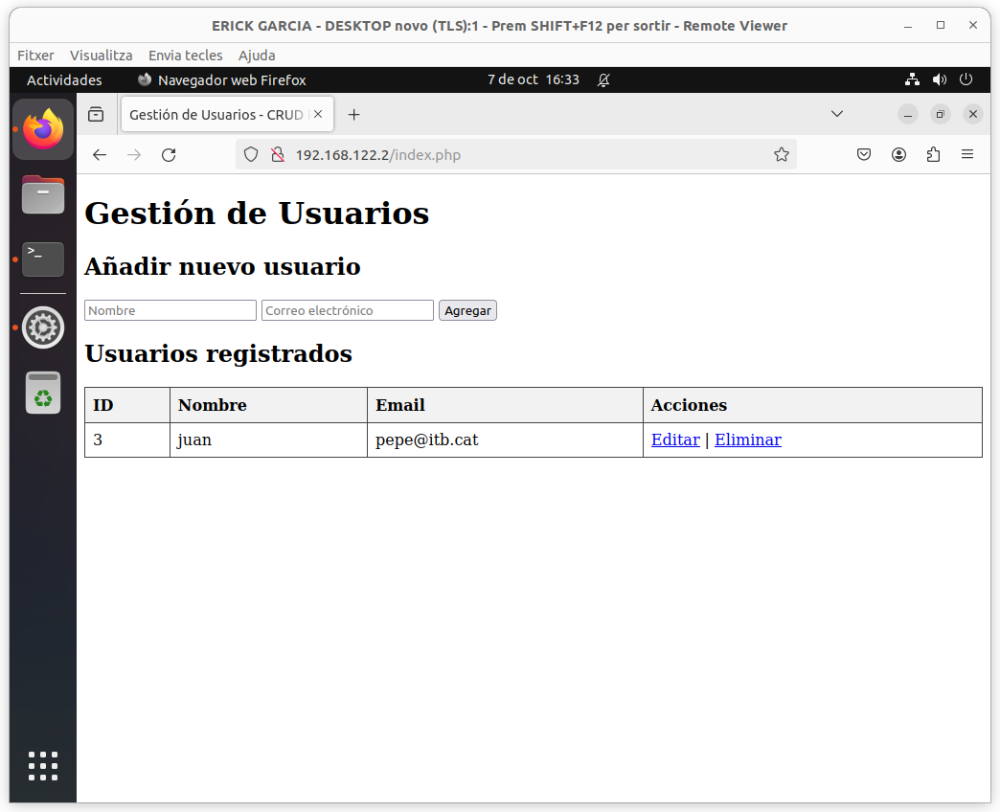
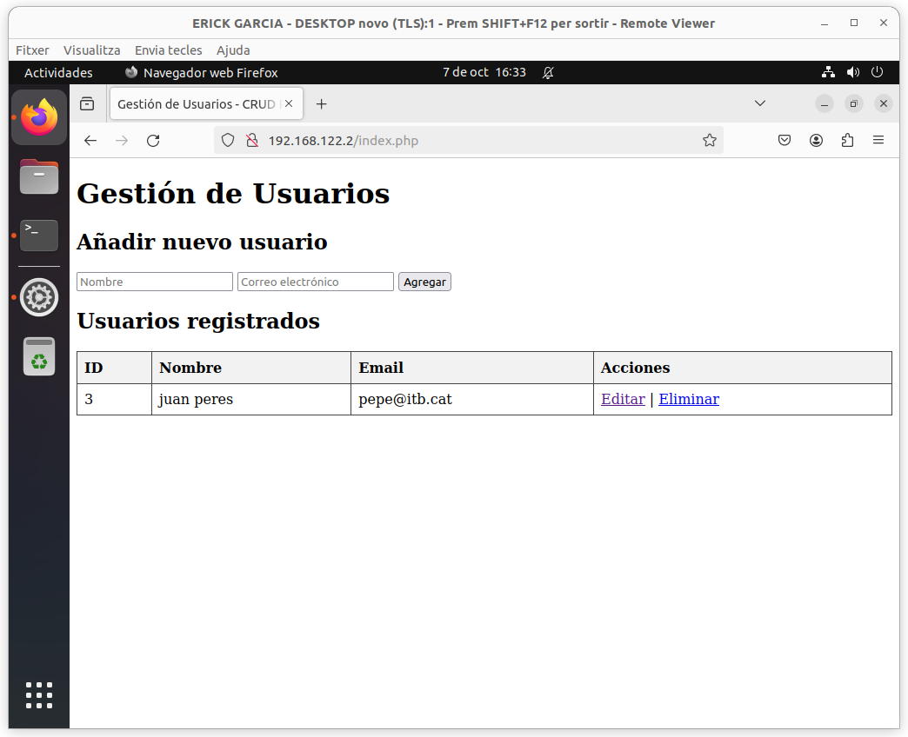
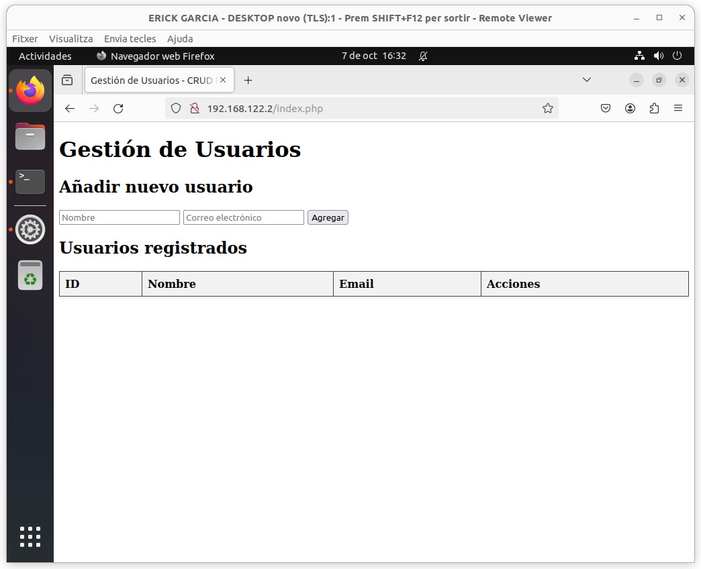
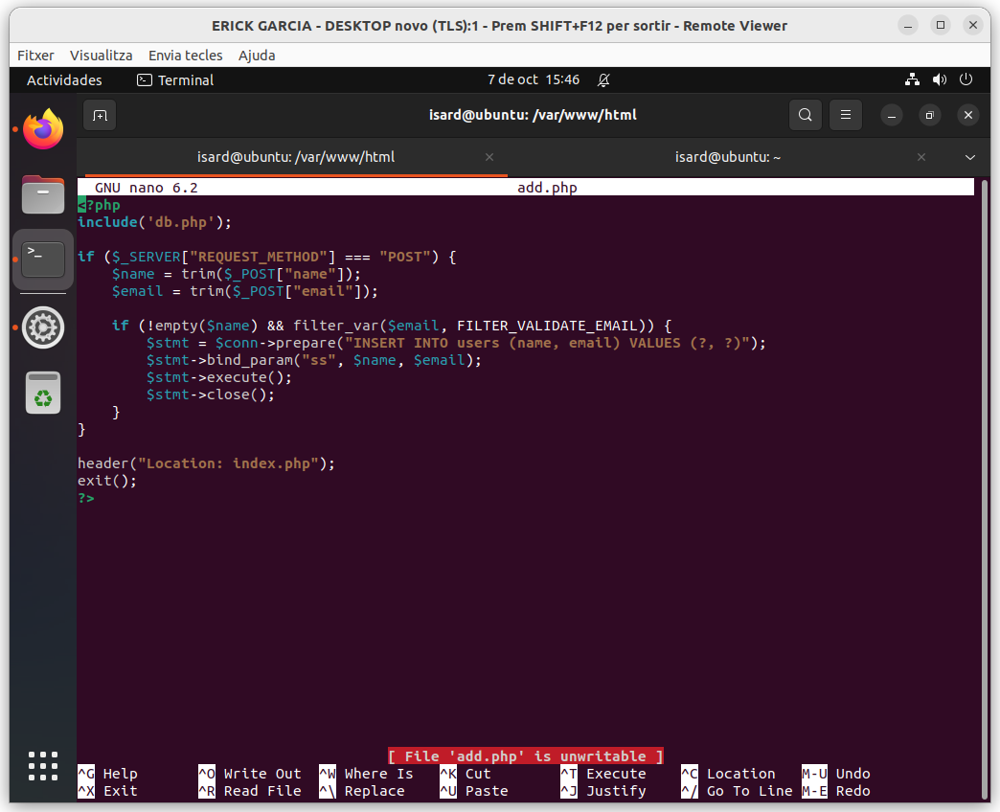
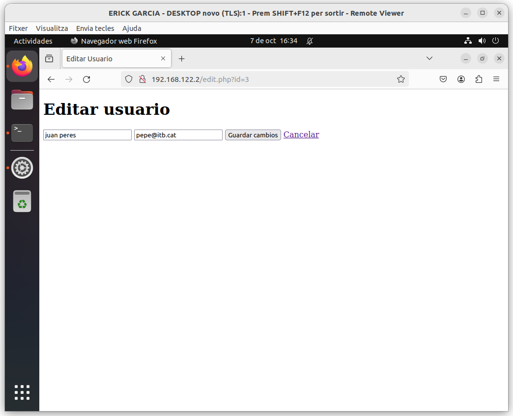

# Guía de Instalación y Pruebas de Base de Datos MySQL

Esta guía explica cómo instalar MySQL, crear y probar usuarios, y conectar tu aplicación web. Se incluyen imágenes clave y explicaciones detalladas del código.

---

## 1. Instalación de MySQL

Instala MySQL en tu servidor.instalador oficial y seguir el asistente de instalación.


Una vez instalado, vamos verificando que el servicio esté activo:



En el código, la conexión se realiza normalmente así:

```php
$conn = new mysqli('localhost', 'root', 'tu_contraseña', 'nombre_bd');
if ($conn->connect_error) {
    die('Error de conexión: ' . $conn->connect_error);
}
```
Este fragmento asegura que la aplicación se detenga si la conexión falla, mostrando el error.

---

## 2. Configuración de Red y Firewall

Abre el puerto 3306 en el firewall para permitir conexiones externas a MySQL:


Permite el acceso a través del firewall para el servicio MySQL:


---

## 3. Creación de la Base de Datos

Crea la base de datos usando la consola MySQL o phpMyAdmin. Por ejemplo:

```sql
CREATE DATABASE crud_db;
```



---

## 4. Creación y Prueba de Usuario

Para crear un usuario, ejecuta:

```sql
CREATE USER 'juan'@'localhost' IDENTIFIED BY 'Password123';
GRANT ALL PRIVILEGES ON crud_db.* TO 'juan'@'localhost';
FLUSH PRIVILEGES;
```



Para probar la edición del usuario, cambia el apellido de "juan".



Con esto vamos verificando que el usuario tiene permisos de edición y que los cambios se reflejan correctamente en la base de datos.

---

## 5. Conexión y Pruebas desde la Aplicación Web

Accede a la web e iremos verificando la conexión con la base de datos. Deberías poder ver la lista de usuarios y realizar operaciones CRUD:



Agrega un usuario desde la web para comprobar la inserción:



Edita el usuario "juan" para asegurarte de que los cambios se guardan:



---

## 6. Diseño y Configuración del Servidor Web

Ubica los archivos PHP en la carpeta correspondiente de tu servidor Apache, por ejemplo `/var/www/html`.


---


