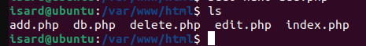

# Diseño y Configuración Web

## 4.1. Estructura del Proyecto y Errores Iniciales (Los 8 Bugs)

El proyecto contiene un total de 8 errores intencionales. Estos son los 5 errores principales de lógica y sintaxis, documentados como Issues Críticas:

| Archivo | Función | Error Documentado (Issue #) | Detalle del Error |
| :--- | :--- | :--- | :--- |
| `db.php` | Conexión DB | **Issue #1** | Hostname mal escrito (`locahost` vs `localhost`). |
| `index.php` | Formulario | **Issue #2** | El método del formulario es `posts` en lugar de `post`. |
| `add.php` | Inserción | **Issue #3** | Sentencia `INSERT` usa `*` en lugar de marcadores de posición `?`. |
| `delete.php`| Eliminación | **Issue #4** | Sentencia `DELETE` usa `DELETE * FROM` en lugar de `DELETE FROM`. |
| `edit.php` | Edición | **Issue #5** | Sentencia `UPDATE` tiene la sintaxis desordenada (falta `SET`). |
| `otros` | Varios | **Issues #6, #7, #8** | (Tres errores de sintaxis o lógica menores aún por documentar). |

## 4.2. Correcciones Realizadas (Flujo GitHub Issues)

Se utiliza el flujo de trabajo de Git (ramas, commits, Pull Requests) para resolver cada Issue.

###  Issue #1: Hostname Incorrecto (`db.php`)

| Archivo | Original (Línea 2) | Corregido (Línea 2) |
| :--- | :--- | :--- |
| `db.php` | `$servername = "locahost";` | `$servername = "localhost";` |

###  Issue #3: Sentencia `INSERT` (`add.php`)

| Archivo | Original (Línea 9) | Corregido (Línea 9) |
| :--- | :--- | :--- |
| `add.php` | `$sql = "INSERT INTO users (name, email) VALUES (*, *)";` | `$sql = "INSERT INTO users (name, email) VALUES (?, ?)";` |

###  Issue #4: Sentencia `DELETE` (`delete.php`)

| Archivo | Original (Línea 7) | Corregido (Línea 7) |
| :--- | :--- | :--- |
| `delete.php`| `$sql = "DELETE * FROM users WHERE id=?";` | `$sql = "DELETE FROM users WHERE id=?";` |

###  Issue #5: Sentencia `UPDATE` (`edit.php`)

| Archivo | Original (Línea 8) | Corregido (Línea 8) |
| :--- | :--- | :--- |
| `edit.php` | `$sql = "UPDATE users WHERE name=?, email=? WHERE id=?";` | `$sql = "UPDATE users SET name=?, email=? WHERE id=?";` |

Una vez corregidos esos cambios, ubicamos todos los archivos en la carpeta /var/www/html de nuestro servidor Apache:

