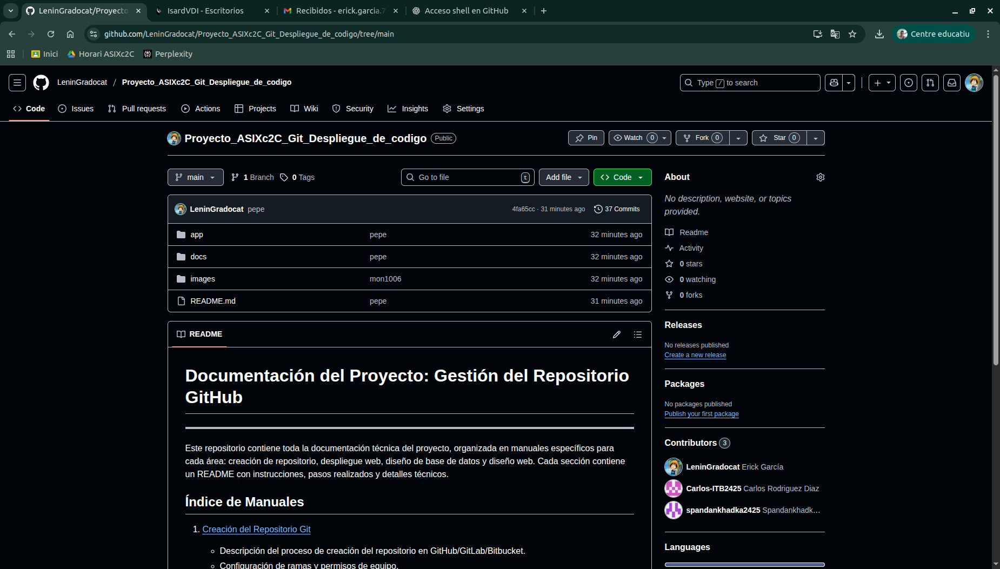

# Creación del Repositorio Git

## Introducción

Se documenta el proceso realizado para la creación y configuración del repositorio Git utilizado en el proyecto. Esta sección detalla los pasos que permitieron gestionar el código fuente de manera colaborativa, incluyendo la organización de ramas, permisos de equipo y el primer commit con el código base.

## Creación del Repositorio

El equipo creó un repositorio en GitHub con los siguientes parámetros:

- **Nombre:** `Proyecto_ASIXc2C_Git_Despliegue_de_codigo`
- **Visibilidad:** Privado o público según los requerimientos del proyecto.
- **README:** Se decidió inicializarlo automáticamente.

> **Nota:** Se utilizó la conexión **SSH** para facilitar la autenticación sin necesidad de usuario y contraseña.



## Configuración de SSH

### Generación de clave SSH
Se generó una clave SSH para autenticación segura sin necesidad de ingresar usuario/contraseña, con el siguiente comando:

```bash
ssh-keygen -t ed25519 -C "correo_del_equipo@ejemplo.com"
```

- La clave pública se agrega a la cuenta de GitHub/GitLab/Bitbucket.
- La clave privada se mantiene en el equipo local con permisos seguros (chmod 600).

## Configuración de ramas y permisos

### Estructura de ramas utilzada:

- **main:** Código estable listo para producción (protegida).

## Primer commit con código base

El primer commit incluye archivos iniciales:

- index.php, db.php, scripts SQL, CSS/JS
- .gitignore para excluir archivos temporales o sensibles

```bash
git add .
git commit -m "Primer commit: código base del proyecto"
git push origin main
```
**Recomendaciones:**
- Mantener la carpeta `apps` únicamente para el código ejecutable.  
- Usar `docs` para toda la documentación, evitando mezclar archivos `.md` con código.  
- Incluir imágenes relevantes en `images` y referenciarlas correctamente en Markdown.

[⬅ Volver a Documentación](README.md)
