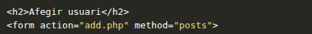
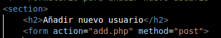

# Despliegue del Servidor Web (Apache + PHP)

En este documento se describe detalladamente el proceso de **instalación, configuración y despliegue** del servidor web que aloja la aplicación desarrollada en PHP. El objetivo es proporcionar una guía técnica completa que permita la correcta instalación de Apache, PHP y la configuración de un entorno funcional y seguro para ejecutar aplicaciones web dinámicas.

El servidor web se ha implementado sobre un sistema operativo **Ubuntu Server 22.04 LTS**, aunque los pasos pueden adaptarse a otras distribuciones Linux basadas en Debian.

## 2.1. Instalación y Configuración

Completamos la instalación de la pila LAMP (Linux, Apache, MySQL, PHP) en el Ubuntu Server.

| Componente | Paquete Instalado | Estado de Verificación |
| :--- | :--- | :--- |
| **Servidor Web** | `apache2` | Correcto (`active (running)`) |
| **PHP** | `php libapache2-mod-php php-mysql` | Correcto (Verificado con `info.php`) |

Se configuró la red con IP estática ***(`192.168.122.2/22`)***

### Instalación de Apache y PHP
### Paso 1: Actualizar los repositorios del sistema

Antes de instalar cualquier paquete, es recomendable actualizar la lista de repositorios y los paquetes existentes:
```bash
sudo apt update && sudo apt upgrade -y
```
### Paso 2: Instalar Apache

El siguiente comando instala el servidor Apache2, para verificar que la instalación fue correcta, se comprueba el estado del servicio:
```bash
sudo apt install apache2 -y
sudo systemctl status apache2
```
El resultado debe mostrar el estado active (running).

### Paso 3: Probar el servidor Apache

Una vez instalado, se puede acceder desde un navegador en la misma máquina:
```bash
http://localhost
```

### Paso 4: Instalar PHP y módulos necesarios

Para permitir que Apache ejecute código PHP, se instala el módulo libapache2-mod-php junto con el intérprete PHP:
```bash
sudo apt install php libapache2-mod-php php-mysql -y
```
- `php`: intérprete principal de PHP.
- `libapache2-mod-php`: permite a Apache procesar archivos PHP.
- `php-mysql`: permite la conexión con bases de datos MySQL o MariaDB.

## 2.2. Despliegue del Código Base

El código del proyecto `app/` fue clonado y copiado a la raíz del servidor (`/var/www/html/`) con los permisos ajustados al usuario `www-data`.

## 2.3. Verificación Inicial de Fallo (Issue #1)

Al intentar acceder a la aplicación después del despliegue, se confirma un fallo de conexión a la base de datos a causa de un error en el archivo index.php:



| Original: `method="posts"` | Correcto: `method="post"` |
| :--- | :--- | :--- |



[⬅ Volver a Documentación](README.md)

